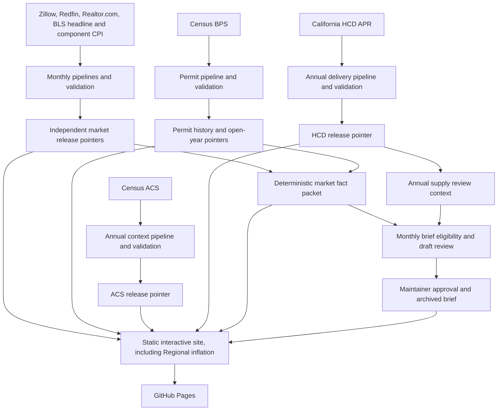

# Housing Market Lab

[](https://github.com/desenlin/housing-market-lab/actions/workflows/pages.yml)
[](LICENSE)
[](https://creativecommons.org/licenses/by/4.0/)

Housing Market Lab is an independent academic project for classroom exploration and research. It organizes selected aggregate Southern California housing indicators into comparable city/community, ZIP-level, and metropolitan views. It does not contain property listings or property-level records.

**Live application:** <https://desenlin.com/housing-market-lab/>

Created by **[Desen Lin](https://desenlin.com/)**, California State University, Fullerton.

## What the application provides

- Zillow Home Value Index (ZHVI) and Zillow Observed Rent Index (ZORI)
- Nominal and CPI-adjusted real values and rents with a user-selected constant-dollar month
- A derived price–rent multiple
- Redfin months of supply, median days on market, sales above original list, price-drop share, and median sale price per square foot
- Realtor.com monthly ZIP-level active and new listings, pending ratio, listing viewers relative to the U.S., and Market Hotness
- Census Building Permits Survey final annual totals from 1980 and monthly place-level estimates from 2022, with revision definitions and explicit Census-imputed flags
- California HCD annual housing-delivery measures: permitted and completed units, completions per 1,000 existing units, ADU contribution, housing types, and secondary affordability detail. A shared metric controls the trend, city ranking and map, with up to five selected jurisdictions.
- A focused ACS five-year housing-context layer covering median household income, tenure, rent burden, household size, median age, and multifamily housing, with 90% margins of error
- City/community structural comparisons between non-overlapping ACS five-year periods; overlapping annual vintages are intentionally omitted
- Explicit source and reporting-window labels, with hover/focus definitions for market concepts
- Current levels and explicitly labeled changes from one year earlier
- User-selected one-, three-, and five-year or maximum chart windows
- Indexed comparisons with a user-selected starting month
- City/community and ZIP rankings sortable by current value or 12-month growth
- Interactive OpenStreetMap context maps with pan, zoom, focused mainland defaults, hover details, gray **No data** boundaries, and a separate legend state for land outside city/CDP geography
- Population-ranked comparisons of the 20 largest U.S. metropolitan statistical areas, plus San Jose as a selected California comparator, including inventory, days-to-pending, price-cut-share, and sale-to-list measures
- A **Regional inflation** data lens within **Prices & Rents**: ten spending categories for the LA area and United States, year-over-year inflation and cumulative price changes, matched-month comparisons, and category definitions on hover/focus
- LA-area and U.S. headline CPI-U benchmarks, including year-over-year inflation overlays

Local real-value views may use the LA-area CPI-U. Cross-metro real-value views instead use one U.S. city-average CPI-U series for every metro, avoiding incomparable local-index coverage and publication schedules. The official October 2025 CPI gap remains visible in CPI overlays; derived real housing series use a disclosed log-linear interpolation for that one month only.

Regional inflation shares the Lab's navigation, header/footer, Recharts figure framework, in-figure time-period buttons, source attribution, and question-mark definitions. The latest comparison table uses the most recent month available for every included series, and users can select or deselect up to five categories. Cumulative changes use an explicit starting month independent of the chart window. Technical interpretation and source-level provenance reside in **Data & methods**. LA CPI represents Los Angeles and Orange counties together; its continuous pre-2018 history covered a broader area. These indexes measure price changes, not dollar budgets or cross-area price levels.

The application is a static Next.js/Vinext export. It uses no database, paid API, paid map service, or continuously running server. Google Analytics measures aggregate traffic using the same property as the academic website.

Data & methods reports **Data checks completed** dates for every provider. These record the Lab’s processing checks, not statistical certification or immunity to source revisions. Permit displays distinguish **Monthly estimates**, **Historical monthly estimates**, and **Final annual totals**; local monthly observations are not benchmarked to final annual totals. Market Brief uses a neutral monthly-estimates badge for permit findings and omits “Validated” badges for other findings. Revision details remain available through question-mark definitions and evidence notes.

## Data sources and references

- [Zillow Research housing data](https://www.zillow.com/research/data/) supplies the market time series.
- [Redfin Data Center](https://www.redfin.com/news/data-center/downloads/) supplies local listing and transaction activity in rolling three-month windows.
- [Realtor.com® Economic Research](https://www.realtor.com/research/data/) supplies monthly ZIP-level inventory and buyer-interest measures.
- [U.S. Bureau of Labor Statistics CPI](https://www.bls.gov/cpi/data.htm) supplies monthly LA-area and U.S. headline, core, food, energy, housing-service, and related CPI-U component observations.
- [U.S. Census Bureau Building Permits Survey](https://www.census.gov/construction/bps/) supplies permit-jurisdiction housing-unit authorizations; [HUD SOCDS](https://www.huduser.gov/socds/permits/) provides a public lookup interface for verification.
- [California HCD Annual Progress Reports](https://www.hcd.ca.gov/housing-open-data-tools/apr-dashboard) supply annual local housing delivery and composition.
- [U.S. Census Bureau American Community Survey](https://www.census.gov/programs-surveys/acs/data.html) supplies selected five-year household and housing-stock estimates and margins of error.
- [US Census Bureau cartographic boundary files](https://www.census.gov/geographies/mapping-files/time-series/geo/cartographic-boundary.html) supply place and ZCTA boundaries.
- [OpenStreetMap](https://www.openstreetmap.org/copyright) supplies contextual basemap tiles. Map data © OpenStreetMap contributors.

Definitions, transformations, boundary vintages, coverage rules, and provider caveats are documented in [DATA_SOURCES.md](DATA_SOURCES.md). Licensing, attribution, and reuse limits for every external source are consolidated in [THIRD_PARTY_DATA.md](THIRD_PARTY_DATA.md). The site publishes compact, geographically filtered, chart-ready extracts rather than complete provider source files.

## Reproducible release architecture




Raw source files are temporary. Zillow releases live in `public/data/releases/<release-id>/`; Redfin and BLS CPI releases live independently in `public/data/redfin/releases/<release-id>/` and `public/data/cpi/releases/<release-id>/`. Realtor.com Inventory and Hotness use separate directories and pointers under `public/data/realtor/` because they can be published at different times. Census boundary geometry has its own pointer under `public/data/maps/`, so unchanged maps are not copied into every Zillow release. Building permits use `history` and `provisional` pointers under `public/data/permits/`, allowing final annual history and open monthly years to advance independently. Each pointer changes only after that source's schema, date, coverage, quality, and size checks succeed. The CPI pipeline retrieves six official BLS bulk files once each and retains only twenty selected series (ten categories × two areas). Failed bulk groups fall back to batched Public Data API requests of at most 25 series and ten years; retrieving all twenty series from 2000 through 2026 requires three fallback requests. Source URLs, retrieval methods, response/file fingerprints, series identifiers, coverage, and missing observations are recorded in the CPI manifest. The existing `la` and `us` headline series continue to provide housing deflators. All required CPI series must validate before its shared pointer advances.

ACS follows a separate annual release-window review in December, January, and February. December and January checks stop after a lightweight vintage check when no newer release exists. February also re-fetches the current estimates to detect same-vintage corrections. Manual runs expose the same revision option. Only confirmed HTTP 404/410 responses mean a vintage is absent; timeouts, rate limits, and server failures are retried and then reported as errors. When retrieval is needed, three keyed Census API requests retrieve only 42 required estimate/MOE fields for California places and ZCTAs; the pipeline then retains only mapped Los Angeles and Orange County records. It publishes roughly 270 KB, reuses existing map geometry, keeps one rollback, keeps comparison endpoints five years apart, and explicitly requests a deployment-only Pages build. A free Census API key is stored only as the repository secret `CENSUS_API_KEY` and is never published.

HCD also uses an independent annual release-window check, in July and October, with manual runs available. The updater checks source metadata and calculation/reference fingerprints before retrieving changed APR data, then publishes only selected Los Angeles and Orange County jurisdiction-year aggregates under `public/data/hcd/`. It reuses existing map geometry and retains one rollback release. Metadata-only changes do not trigger deployment; a validated content release requests a deployment-only Pages build. HCD rebuilds from the current APR snapshot and checks historical coverage loss before publishing. See [HCD methods](DATA_SOURCES.md#california-hcd-housing-delivery).

Routine permit updates use the latest cumulative West-region monthly files and publish compact local observations when they change. New final annual years are detected automatically. The January, April, July, and October 28 checks also re-fetch historical annual/monthly files and the configured ACS housing-stock inputs to detect same-vintage corrections; manual Pages runs expose `recheck_history`. A history rebuild also rebuilds the open monthly years so corrected reference inputs stay consistent. The ACS denominator remains at its explicitly configured vintage. Unchanged observation content retains the existing release identifier and rollback history.

The Realtor.com pipeline first compares the upstream ETag or modification metadata with the last validated release. It streams the large national history only when the source changes, never saves that national file, and publishes only compact chart-ready observations for the two-county ZIP reference. Reported observations are retained when Realtor.com assigns its row-level quality flag; compact month-index lists carry those flags into charts, rankings, and maps without duplicating the series. Every provider keeps the current validated release and one rollback release.

Monthly market-series releases use a merge-forward history policy. If a provider later replaces a full-history download with a rolling window, dates absent from the new file are carried forward from the last validated compact extract. Dates still present in the provider file—including revisions and explicit missing values—follow the new release. County sharding keeps generated JSON objects below 1 MB, and a 25 MB working-tree budget prevents silent storage growth. See [Storage and historical continuity](STORAGE_DESIGN.md).

Provider source families follow independent release-window checks so each validated release can advance when available. A failed provider download or validation does not replace that provider's prior working release or prevent another provider from updating.

The repository retains four workflows: Pages/provider updates (monthly on the 12th, 18th, 24th, and 28th), ACS (December–February), HCD (July and October), and market-brief draft review after successful Pages runs. No separate workflow is needed for inflation components or annual permit totals.

`scripts/data_health.py` audits observation coverage for every manifest series, rather than treating a recent processing timestamp as fresh data. [Monitoring policy](config/data_health_policy.json) sets source-specific grace windows, a longer lag for Zillow sale-to-list data, annual thresholds for annual series, and dated BLS/Census release overrides. These are operational alert thresholds, not promised provider publication dates. A first partial update failure produces a warning; two consecutive failed attempts, overdue/missing observations, or failure of every attempted provider produces a failed data-health check. Pages deployment remains independent and can serve releases that pass validation. The brief workflow requires overall Pages success, so it does not automatically prepare a draft while that check is failing.

A small [update-state file](.github/data-update-state.json) preserves each provider's last attempt, last successful check, and failure streak across runners, including failed updates. A successful no-change check clears the streak; deploy-only runs do not. Rerunning the same Actions run does not count as another consecutive failed run. State is committed separately from public releases if release/storage validation fails. Annual workflows report and retain their own failed checks as well. The Actions summary no longer claims overall success when a provider reported an error.

The same health summary flags an annual reference review, next due **January 15, 2027**. Review Census boundaries/Gazetteer/ZCTA vintages, metro population ranks, the fixed ACS permit/HCD stock denominator, and release-calendar overrides. These remain deliberate, pinned choices until a maintainer reviews coverage and comparability; a newer ACS context release does not silently rebase historical permitting rates. Record the review and next due date in `config/data_health_policy.json`. See [monitoring and reference methods](DATA_SOURCES.md#automated-checks-and-reference-review).

After each successful site and data validation, the live **Current evidence snapshot** is rebuilt automatically from an expandable internal question registry. The current registry spans prices, rents, availability, market speed, seller adjustment, competition, listing flows, construction, and pre-specified relationships among indicators. The registry is intentionally broader than the public brief: it currently produces 27 data-release questions, plus separate annual HCD and ACS review checks, while the snapshot displays at most four findings and no more than one per theme.

“Meaningful” is defined through four deterministic qualification paths rather than subjective prose or tail-event probabilities. A question can qualify when its primary measure crosses a fixed editorial threshold; when at least 65% of calculable local markets move in one direction and their median reaches half its threshold; when the year-over-year direction changes with the current and preceding changes each reaching half the threshold; or when a pre-specified relationship between indicators diverges. Breadth findings require at least 70% calculable coverage. Supporting facts preserve calculations and provenance but do not independently trigger a question.

Materiality thresholds remain fixed editorial reporting filters, not statistical-significance tests or definitions of rare events: for example, 1% for inflation-adjusted home values, 1.5% for typical asking rent, 5% for for-sale inventory, and 10% for matched Los Angeles metro year-to-date permit counts. Other metrics have unit-appropriate thresholds in configuration. Exact unrounded values determine eligibility.

The separate **Prepare market brief for review** workflow compares qualified questions with the latest approved edition and prepares a draft only when newer qualifying evidence exists. Its headline, summary, and body include only the selected findings. It evaluates the exact commit validated by the successful Pages run and cannot publish or merge an edition. The current snapshot is therefore an automatic evidence screen; an edition enters the archive only through maintainer review and merge of its draft pull request. The August 2026 historical reconstruction remains immutable, and the September 2026 edition is the first archive produced by the expanded rationale.

Housing Supply review rules: the brief's recurring construction question uses Census BPS monthly/YTD authorizations and opens the Permit activity lens. A separate HCD check verifies the annual payload against its release fingerprints, records city reporting coverage, and distinguishes first review, a new reporting year, revisions, and unchanged evidence. Its status appears in the workflow summary even when no monthly draft is recommended. HCD changes do not advance the monthly questions or publish an annual finding automatically. A candidate retains the HCD review context for comparison with the next approved edition; reviewers must separately verify and cite any HCD finding they add. Snapshots validated after the issue cutoff are ineligible for that issue. Historical briefs remain unchanged.

The permitting brief reports a derived Los Angeles metro aggregate: matched-jurisdiction counts from Los Angeles and Orange counties are summed for the same year-to-date months in both years. Growth is computed from those sums, not averaged from county growth rates. This is not a separately published Census BPS metro series. The answer gives the percentage change; one evidence line gives current and prior counts, with the reporting window, derived-geography coverage, and revision caveat retained in the evidence details and future archived editions. County facts remain available for auditing; historical editions retain their original wording.

Repository settings must permit GitHub Actions to create pull requests. Reviewers should verify the evidence lines, observation periods, monthly-estimate labels and revision disclosures, source releases, and fact-packet fingerprint before merging. If the readiness gates do not pass, the workflow records “no draft recommended” in its run summary and makes no repository change.

Provider releases do not need to arrive in the same order. If BLS CPI arrives before Zillow, the CPI pointer advances and waits for the next housing observation. If Zillow arrives first, nominal housing data advance immediately while real series stop at the latest month with an observation in both datasets. A later validated update extends the real series. CPI is never carried forward; the only derived exception is the documented October 2025 geometric interpolation between the adjacent official months.

## Local development

Requirements: Node 24+, Python 3.11+, and npm.

```bash
npm run install:ci
python -m pip install -r requirements.txt
python pipeline/update_data.py
python pipeline/update_redfin.py
python pipeline/update_realtor.py
python pipeline/update_cpi.py
python pipeline/update_permits.py
python pipeline/update_acs.py
python pipeline/update_hcd.py
npm run dev
```

For repeated Zillow pipeline development, `--cache-dir .cache/zillow` reuses local downloads. The Redfin and Realtor.com pipelines stream national CSVs and retain only configured dates and two-county geographies; they never store full raw downloads. Routine ACS updates require `CENSUS_API_KEY`. The maintainer-only `--bootstrap-bulk` option can seed a release by streaming selected Census table files without retaining them, while routine ACS processing uses the much smaller API requests.

For HCD development, `python pipeline/update_hcd.py --pilot` validates county-filtered aggregates without publishing. `--force` rechecks unchanged metadata without bypassing validation.

Build and test:

```bash
npm run lint
npm test
python -m unittest discover tests
```

GitHub Pages must use **GitHub Actions** as its deployment source in repository **Settings → Pages**.

## Citation

Please cite the application when it is used in instruction, research, or derivative work:

> Lin, D. (2026). *Housing Market Lab* [Computer software]. https://desenlin.com/housing-market-lab/

GitHub also provides structured citation metadata from [CITATION.cff](CITATION.cff) through the repository’s **Cite this repository** control. For a reproducible empirical reference, report the release identifier and bundle fingerprint displayed under **Data & methods** in the application.

## Academic-use disclaimer

This project is provided for instruction and academic research. It is not financial, investment, legal, valuation, or real-estate advice and should not be relied on for transactions or commercial decision-making.

The application's intended use is instruction and academic research. This purpose statement is not a license for, or an additional restriction on, third-party data. Zillow, Redfin, Realtor.com, Census, and OpenStreetMap materials remain subject to their respective provider licenses and terms. This repository does not grant commercial-use or redistribution rights to third-party data or imply endorsement by any provider or California State University, Fullerton.

## Licenses and attribution

The original software code in this repository is licensed under the [MIT License](LICENSE). Original educational prose and project-authored explanatory material are licensed under [Creative Commons Attribution 4.0 International](LICENSE-CONTENT.md), unless otherwise noted. When reusing or adapting original project materials, credit Desen Lin and link to this repository. The [licensing map](LICENSES.md) explains which terms apply to each category of material.

Third-party data, cartographic boundaries, map tiles, institutional names, and trademarks are excluded from both licenses. No rights to those materials are granted by this repository. Data provided by Zillow Group, Redfin, and Realtor.com® Economic Research. Map data © OpenStreetMap contributors. See [Third-party data, licensing, and attribution](THIRD_PARTY_DATA.md) before reusing any data files.
