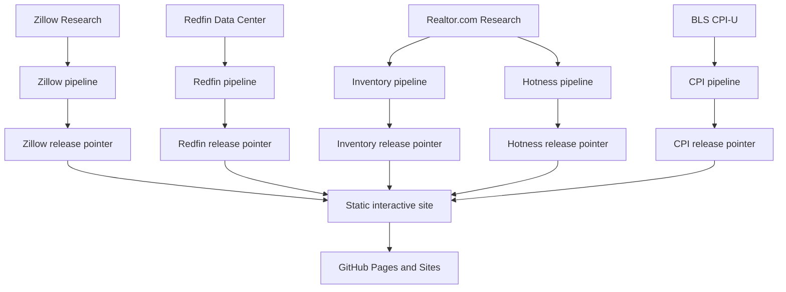

# Housing Market Lab

[](https://github.com/desenlin/housing-market-lab/actions/workflows/pages.yml)
[](LICENSE)
[](https://creativecommons.org/licenses/by/4.0/)

Interactive housing-market analytics for instruction and exploratory academic research. The current release focuses on city/community and ZIP-level observations in Orange and Los Angeles counties, with a separate metropolitan comparison view.

**Live application:** <https://desenlin.com/housing-market-lab/>

Created by **[Desen Lin](https://desenlin.com/)**, California State University, Fullerton.

## What the application provides

- Zillow Home Value Index (ZHVI) and Zillow Observed Rent Index (ZORI)
- Nominal and CPI-adjusted real values and rents with a user-selected constant-dollar month
- A derived price–rent multiple
- Redfin months of supply, median days on market, sales above original list, price-drop share, and median sale price per square foot
- Realtor.com monthly ZIP-level active and new listings, pending ratio, listing viewers relative to the U.S., and Market Hotness
- Explicit source and reporting-window labels, with hover/focus definitions for market concepts
- Current levels and explicitly labeled changes from one year earlier
- User-selected one-, three-, and five-year or maximum chart windows
- Indexed comparisons with a user-selected starting month
- City/community and ZIP rankings sortable by current value or 12-month growth
- Interactive OpenStreetMap context maps with pan, zoom, automatic county fitting, hover details, gray **No data** boundaries, and a separate legend state for land outside city/CDP geography
- Metro inventory, days to pending, price-cut share, and sale-to-list comparisons
- LA-area and U.S. CPI-U benchmarks, including year-over-year inflation overlays

The application is a static Next.js/Vinext export. It uses no database, paid API, paid map service, or continuously running server. Google Analytics measures aggregate traffic using the same property as the academic website.

## Data sources and references

- [Zillow Research housing data](https://www.zillow.com/research/data/) supplies the market time series.
- [Redfin Data Center](https://www.redfin.com/news/data-center/downloads/) supplies local listing and transaction activity in rolling three-month windows.
- [Realtor.com® Economic Research](https://www.realtor.com/research/data/) supplies monthly ZIP-level inventory and buyer-interest measures.
- [U.S. Bureau of Labor Statistics CPI](https://www.bls.gov/cpi/data.htm) supplies monthly LA-area and U.S. all-items CPI-U observations.
- [US Census Bureau cartographic boundary files](https://www.census.gov/geographies/mapping-files/time-series/geo/cartographic-boundary.html) supply place and ZCTA boundaries.
- [OpenStreetMap](https://www.openstreetmap.org/copyright) supplies contextual basemap tiles. Map data © OpenStreetMap contributors.

Definitions, transformations, boundary vintages, coverage rules, and provider caveats are documented in [DATA_SOURCES.md](DATA_SOURCES.md). Provider data are redistributed only as compact, geographically filtered, chart-ready releases rather than complete source files.

## Reproducible release architecture



Raw source files are temporary. Zillow releases live in `public/data/releases/<release-id>/`; Redfin and BLS CPI releases live independently in `public/data/redfin/releases/<release-id>/` and `public/data/cpi/releases/<release-id>/`. Realtor.com Inventory and Hotness use separate directories and pointers under `public/data/realtor/` because they can be published at different times. Each pointer changes only after that source's schema, date, coverage, quality, and size checks succeed. The CPI pipeline reads BLS's official bulk time-series file first and uses the Public Data API only as a fallback, avoiding routine dependence on the API's unregistered daily quota.

The Realtor.com pipeline first compares the upstream ETag or modification metadata with the last validated release. It streams the large national history only when the source changes, never saves that national file, and publishes only compact chart-ready observations for the two-county ZIP reference. Reported observations are retained when Realtor.com assigns its row-level quality flag; compact month-index lists carry those flags into charts, rankings, and maps without duplicating the series. Each Realtor.com product is capped at 5 MB per release and retains the latest three validated releases, providing rollback without unbounded repository growth.

The Pages workflow runs on pushes, manual dispatch, and four staggered monthly refresh attempts (the 12th, 18th, 24th, and 28th). Each scheduled attempt checks Zillow, Redfin, Realtor.com Inventory, Realtor.com Hotness, and BLS CPI independently. A failed provider download or validation does not replace that provider's prior working release or prevent another provider from refreshing.

Provider releases do not need to arrive in the same order. If BLS CPI arrives before Zillow, the CPI pointer advances and waits for the next housing observation. If Zillow arrives first, nominal housing data advance immediately while real series stop at the latest month with an official observation in both datasets. A later successful refresh extends the real series automatically; the pipeline never carries CPI forward or substitutes a neighboring month.

## Local development

Requirements: Node 24+, Python 3.11+, and npm.

```bash
npm run install:ci
python -m pip install -r requirements.txt
python pipeline/update_data.py
python pipeline/update_redfin.py
python pipeline/update_realtor.py
python pipeline/update_cpi.py
npm run dev
```

For repeated Zillow pipeline development, `--cache-dir .cache/zillow` reuses local downloads. The Redfin and Realtor.com pipelines stream national CSVs and retain only configured dates and two-county geographies; they never store full raw downloads.

Build and test:

```bash
npm run lint
npm test
python -m unittest discover tests
```

GitHub Pages must use **GitHub Actions** as its deployment source in repository **Settings → Pages**.

## Citation

Please cite the application when it is used in instruction, research, or derivative work:

> Lin, D. (2026). *Housing Market Lab* [Computer software]. https://desenlin.com/housing-market-lab/

GitHub also provides structured citation metadata from [CITATION.cff](CITATION.cff) through the repository’s **Cite this repository** control. For a reproducible empirical reference, report the release identifier and bundle fingerprint displayed under **Data & methods** in the application.

## Academic-use disclaimer

This project is provided for instruction and academic research. It is not financial, investment, legal, valuation, or real-estate advice and should not be relied on for transactions or commercial decision-making.

The filtered data releases are intended for instructional and noncommercial academic-research use. Zillow, Redfin, Realtor.com, Census, and OpenStreetMap data remain subject to their respective provider licenses and terms. This repository does not grant commercial-use rights to third-party data or imply endorsement by any provider or California State University, Fullerton.

## Licenses and attribution

The original software code in this repository is licensed under the [MIT License](LICENSE). Original educational content is licensed under [Creative Commons Attribution 4.0 International](https://creativecommons.org/licenses/by/4.0/), unless otherwise noted. When reusing or adapting original project materials, credit Desen Lin and link to this repository.

Third-party data, cartographic boundaries, institutional names, and trademarks are excluded from those licenses. Data provided by Zillow Group, Redfin, and Realtor.com® Economic Research. Map data © OpenStreetMap contributors.
