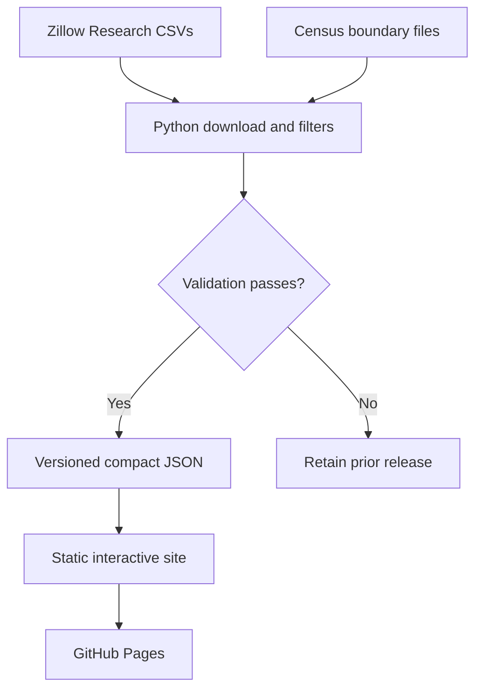

# Housing Market Lab

[](https://github.com/desenlin/housing-market-lab/actions/workflows/pages.yml)
[](LICENSE)
[](https://creativecommons.org/licenses/by/4.0/)

Interactive housing-market analytics for instruction and exploratory academic research. The current release focuses on city/community and ZIP-level observations in Orange and Los Angeles counties, with a separate metropolitan comparison view.

**Live application:** <https://desenlin.com/housing-market-lab/>

Created by **Desen Lin, California State University, Fullerton**.

## What the application provides

- Zillow Home Value Index (ZHVI) and Zillow Observed Rent Index (ZORI)
- A derived price–rent multiple
- Current levels and explicitly labeled changes from one year earlier
- User-selected one-, three-, and five-year or maximum chart windows
- Indexed comparisons with a user-selected starting month
- City/community and ZIP rankings sortable by current value or 12-month growth
- Interactive OpenStreetMap context maps with pan, zoom, automatic county fitting, hover details, and selectable boundaries
- Metro inventory, days to pending, price-cut share, and sale-to-list comparisons

The application is a static Next.js/Vinext export. It uses no database, paid API, paid map service, analytics account, or continuously running server.

## Data sources and references

- [Zillow Research housing data](https://www.zillow.com/research/data/) supplies the market time series.
- [US Census Bureau cartographic boundary files](https://www.census.gov/geographies/mapping-files/time-series/geo/cartographic-boundary.html) supply place and ZCTA boundaries.
- [OpenStreetMap](https://www.openstreetmap.org/copyright) supplies contextual basemap tiles. Map data © OpenStreetMap contributors.

Definitions, transformations, boundary vintages, coverage rules, and provider caveats are documented in [DATA_SOURCES.md](DATA_SOURCES.md). Zillow data are redistributed only as compact, geographically filtered, chart-ready releases rather than complete source files.

## Reproducible release architecture



Raw source files are temporary. Processed releases live in `public/data/releases/<release-id>/`; the application reads the release named by `public/data/latest.json`. The pointer changes only after every source, schema, coverage, mapping, and size check succeeds.

The Pages workflow runs on pushes, manual dispatch, and two monthly refresh attempts. A failed provider download or validation does not replace the prior working release.

## Local development

Requirements: Node 24+, Python 3.11+, and npm.

```bash
npm run install:ci
python -m pip install -r requirements.txt
python pipeline/update_data.py
npm run dev
```

For repeated pipeline development, `--cache-dir .cache/zillow` reuses local downloads. Production refreshes intentionally download fresh source files.

Build and test:

```bash
npm run lint
npm test
python -m unittest discover tests
```

GitHub Pages must use **GitHub Actions** as its deployment source in repository **Settings → Pages**.

## Citation

Please cite the application when it is used in instruction, research, or derivative work:

> Lin, D. (2026). *Housing Market Lab* [Computer software]. https://desenlin.com/housing-market-lab/

GitHub also provides structured citation metadata from [CITATION.cff](CITATION.cff) through the repository’s **Cite this repository** control. For a reproducible empirical reference, report the release identifier and bundle fingerprint displayed under **Data & methods** in the application.

## Academic-use disclaimer

This project is provided for instruction and academic research. It is not financial, investment, legal, valuation, or real-estate advice and should not be relied on for transactions or commercial decision-making.

The filtered data releases are intended for instructional and noncommercial academic-research use. Zillow, Census, and OpenStreetMap data remain subject to their respective provider licenses and terms. This repository does not grant commercial-use rights to third-party data or imply endorsement by any provider or California State University, Fullerton.

## Licenses and attribution

The original software code in this repository is licensed under the [MIT License](LICENSE). Original educational content is licensed under [Creative Commons Attribution 4.0 International](https://creativecommons.org/licenses/by/4.0/), unless otherwise noted. When reusing or adapting original project materials, credit Desen Lin and link to this repository.

Third-party data, cartographic boundaries, institutional names, and trademarks are excluded from those licenses. Data provided by Zillow Group. Map data © OpenStreetMap contributors.
