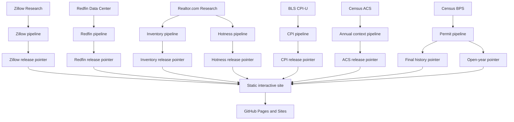

# Housing Market Lab

[](https://github.com/desenlin/housing-market-lab/actions/workflows/pages.yml)
[](LICENSE)
[](https://creativecommons.org/licenses/by/4.0/)

Southern California housing data for teaching and academic research. The current release focuses on city/community and ZIP-level observations in Orange and Los Angeles counties, with a separate metropolitan comparison view.

**Live application:** <https://desenlin.com/housing-market-lab/>

Created by **[Desen Lin](https://desenlin.com/)**, California State University, Fullerton.

## What the application provides

- Zillow Home Value Index (ZHVI) and Zillow Observed Rent Index (ZORI)
- Nominal and CPI-adjusted real values and rents with a user-selected constant-dollar month
- A derived price–rent multiple
- Redfin months of supply, median days on market, sales above original list, price-drop share, and median sale price per square foot
- Realtor.com monthly ZIP-level active and new listings, pending ratio, listing viewers relative to the U.S., and Market Hotness
- Census Building Permits Survey annual history from 1980 and monthly place-level observations from 2022, with explicit preliminary and imputation status
- A focused ACS five-year housing-context layer covering median household income, tenure, rent burden, household size, median age, and multifamily housing, with 90% margins of error
- City/community structural comparisons between non-overlapping ACS five-year periods; overlapping annual vintages are intentionally omitted
- Explicit source and reporting-window labels, with hover/focus definitions for market concepts
- Current levels and explicitly labeled changes from one year earlier
- User-selected one-, three-, and five-year or maximum chart windows
- Indexed comparisons with a user-selected starting month
- City/community and ZIP rankings sortable by current value or 12-month growth
- Interactive OpenStreetMap context maps with pan, zoom, focused mainland defaults, hover details, gray **No data** boundaries, and a separate legend state for land outside city/CDP geography
- Population-ranked comparisons of the 20 largest U.S. metropolitan statistical areas, plus San Jose as a selected California comparator, including inventory, days-to-pending, price-cut-share, and sale-to-list measures
- LA-area and U.S. CPI-U benchmarks, including year-over-year inflation overlays

Local real-value views may use the LA-area CPI-U. Cross-metro real-value views instead use one U.S. city-average CPI-U series for every metro, avoiding incomparable local-index coverage and publication schedules. The official October 2025 CPI gap remains visible in CPI overlays; derived real housing series use a disclosed log-linear interpolation for that one month only.

The application is a static Next.js/Vinext export. It uses no database, paid API, paid map service, or continuously running server. Google Analytics measures aggregate traffic using the same property as the academic website.

## Data sources and references

- [Zillow Research housing data](https://www.zillow.com/research/data/) supplies the market time series.
- [Redfin Data Center](https://www.redfin.com/news/data-center/downloads/) supplies local listing and transaction activity in rolling three-month windows.
- [Realtor.com® Economic Research](https://www.realtor.com/research/data/) supplies monthly ZIP-level inventory and buyer-interest measures.
- [U.S. Bureau of Labor Statistics CPI](https://www.bls.gov/cpi/data.htm) supplies monthly LA-area and U.S. all-items CPI-U observations.
- [U.S. Census Bureau Building Permits Survey](https://www.census.gov/construction/bps/) supplies permit-jurisdiction housing-unit authorizations; [HUD SOCDS](https://www.huduser.gov/socds/permits/) provides a public lookup interface for verification.
- [U.S. Census Bureau American Community Survey](https://www.census.gov/programs-surveys/acs/data.html) supplies selected five-year household and housing-stock estimates and margins of error.
- [US Census Bureau cartographic boundary files](https://www.census.gov/geographies/mapping-files/time-series/geo/cartographic-boundary.html) supply place and ZCTA boundaries.
- [OpenStreetMap](https://www.openstreetmap.org/copyright) supplies contextual basemap tiles. Map data © OpenStreetMap contributors.

Definitions, transformations, boundary vintages, coverage rules, and provider caveats are documented in [DATA_SOURCES.md](DATA_SOURCES.md). Licensing, attribution, and reuse limits for every external source are consolidated in [THIRD_PARTY_DATA.md](THIRD_PARTY_DATA.md). The site publishes compact, geographically filtered, chart-ready extracts rather than complete provider source files.

## Reproducible release architecture



Raw source files are temporary. Zillow releases live in `public/data/releases/<release-id>/`; Redfin and BLS CPI releases live independently in `public/data/redfin/releases/<release-id>/` and `public/data/cpi/releases/<release-id>/`. Realtor.com Inventory and Hotness use separate directories and pointers under `public/data/realtor/` because they can be published at different times. Census boundary geometry has its own pointer under `public/data/maps/`, so unchanged maps are not copied into every Zillow release. Building permits use `history` and `provisional` pointers under `public/data/permits/`, allowing final annual history and open monthly years to advance independently. Each pointer changes only after that source's schema, date, coverage, quality, and size checks succeed. The CPI pipeline reads BLS's official bulk time-series file first and uses the Public Data API only as a fallback, avoiding routine dependence on the API's unregistered daily quota.

ACS follows a separate annual release-window review in December, January, and February. Processing stops after a lightweight vintage check when the published vintage remains current. When a new five-year vintage appears, the keyed Census API retrieves only 42 required estimate/MOE fields for California places and ZCTAs; the pipeline then retains only mapped Los Angeles and Orange County records. It publishes roughly 270 KB, reuses existing map geometry, keeps one rollback, and advances the non-overlapping comparison endpoint by five years. A free Census API key is stored only as the repository secret `CENSUS_API_KEY` and is never published.

Permit updates use only the latest cumulative West-region monthly file, publish roughly 80 KB of local observations when it changes, and leave the final-history bundle untouched. The 1980–present annual archive and fixed ACS housing-stock denominator are rebuilt only after a new final annual BPS file appears. This keeps the monthly review lightweight while preserving a complete auditable history.

The Realtor.com pipeline first compares the upstream ETag or modification metadata with the last validated release. It streams the large national history only when the source changes, never saves that national file, and publishes only compact chart-ready observations for the two-county ZIP reference. Reported observations are retained when Realtor.com assigns its row-level quality flag; compact month-index lists carry those flags into charts, rankings, and maps without duplicating the series. Every provider keeps the current validated release and one rollback release.

All local chart releases use a merge-forward history policy. If a provider later replaces a full-history download with a rolling window, dates absent from the new file are carried forward from the last validated compact extract. Dates still present in the provider file—including revisions and explicit missing values—follow the new release. County sharding keeps generated JSON objects below 1 MB, and a 25 MB working-tree budget prevents silent storage growth. See [Storage and historical continuity](STORAGE_DESIGN.md).

Zillow updates are maintainer-initiated: the ten configured Zillow Research CSVs are obtained separately and supplied to the local pipeline. The pipeline makes no Zillow network requests. Redfin, Realtor.com Inventory, Realtor.com Hotness, BLS CPI, and Census building permits follow independent release-window checks. A failed provider download or validation does not replace that provider's prior working release or prevent another provider from updating.

After a successful site and data validation, the separate **Prepare market brief for review** process evaluates the four recurring questions. It recommends a new edition only when at least two questions have newer observation periods than the latest approved archive, or when one newer question contains a material change, and the fact packet is not already represented there. When those gates pass, the process writes a deterministic candidate to a dedicated branch and opens or updates a draft pull request. It cannot merge the pull request or publish the edition; the maintainer's review and merge are the publication gate. It can also be started manually with an optional issue month. Its force option bypasses only the advancement rule—not duplicate-edition, reused-packet, or future-period safeguards.

Repository settings must permit GitHub Actions to create pull requests. Reviewers should verify the evidence lines, observation periods, preliminary labels, source releases, and fact-packet fingerprint before merging. If the readiness gates do not pass, the workflow records “no draft recommended” in its run summary and makes no repository change.

Provider releases do not need to arrive in the same order. If BLS CPI arrives before Zillow, the CPI pointer advances and waits for the next housing observation. If Zillow arrives first, nominal housing data advance immediately while real series stop at the latest month with an observation in both datasets. A later validated update extends the real series. CPI is never carried forward; the only derived exception is the documented October 2025 geometric interpolation between the adjacent official months.

## Local development

Requirements: Node 24+, Python 3.11+, and npm.

```bash
npm run install:ci
python -m pip install -r requirements.txt
python pipeline/update_data.py --source-dir /path/to/zillow-csvs --skip-maps
python pipeline/update_redfin.py
python pipeline/update_realtor.py
python pipeline/update_cpi.py
python pipeline/update_permits.py
python pipeline/update_acs.py
npm run dev
```

For a Zillow update, download the ten city, ZIP, and metro files identified in `config/sources.json` from Zillow Research and place them in one local directory. Provider filenames can be retained, or the files can be renamed to their configured source IDs, such as `city_zhvi.csv`. The command above verifies that every required file is present before processing and makes no Zillow network request. The source directory should remain outside the repository; raw files are not committed.

The Redfin and Realtor.com pipelines stream national CSVs and retain only configured dates and two-county geographies; they never store full raw downloads. Routine ACS updates require `CENSUS_API_KEY`. The maintainer-only `--bootstrap-bulk` option can seed a release by streaming selected Census table files without retaining them, while routine ACS processing uses the much smaller API requests.

Build and test:

```bash
npm run lint
npm test
python -m unittest discover tests
```

GitHub Pages must use **GitHub Actions** as its deployment source in repository **Settings → Pages**.

## Citation

Please cite the application when it is used in instruction, research, or derivative work:

> Lin, D. (2026). *Housing Market Lab* [Computer software]. https://desenlin.com/housing-market-lab/

GitHub also provides structured citation metadata from [CITATION.cff](CITATION.cff) through the repository’s **Cite this repository** control. For a reproducible empirical reference, report the release identifier and bundle fingerprint displayed under **Data & methods** in the application.

## Academic-use disclaimer

This project is provided for instruction and academic research. It is not financial, investment, legal, valuation, or real-estate advice and should not be relied on for transactions or commercial decision-making.

The application's intended use is instruction and academic research. This purpose statement is not a license for, or an additional restriction on, third-party data. Zillow, Redfin, Realtor.com, Census, and OpenStreetMap materials remain subject to their respective provider licenses and terms. This repository does not grant commercial-use or redistribution rights to third-party data or imply endorsement by any provider or California State University, Fullerton.

## Licenses and attribution

The original software code in this repository is licensed under the [MIT License](LICENSE). Original educational prose and project-authored explanatory material are licensed under [Creative Commons Attribution 4.0 International](LICENSE-CONTENT.md), unless otherwise noted. When reusing or adapting original project materials, credit Desen Lin and link to this repository. The [licensing map](LICENSES.md) explains which terms apply to each category of material.

Third-party data, cartographic boundaries, map tiles, institutional names, and trademarks are excluded from both licenses. No rights to those materials are granted by this repository. Data provided by Zillow Group, Redfin, and Realtor.com® Economic Research. Map data © OpenStreetMap contributors. See [Third-party data, licensing, and attribution](THIRD_PARTY_DATA.md) before reusing any data files.
