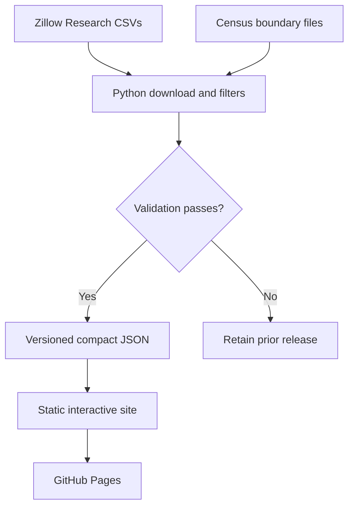

# Housing Market Lab

A zero-cost, static housing-market data product for teaching and exploratory research. The first release focuses on city/community and ZIP-level data in Orange and Los Angeles counties, plus a concise metro comparison view.

Live site: <https://desenlin.github.io/housing-market-lab/>

## What it shows

- Zillow Home Value Index (ZHVI)
- Zillow Observed Rent Index (ZORI)
- A derived price–rent multiple
- Metro inventory, days to pending, price-cut share, and sale-to-list ratio
- Levels, year-over-year changes, and indexed time paths
- Clickable Census place and ZCTA maps

The interface is a static Next.js/Vinext export. It uses no database, paid API, map-tile service, analytics account, or server process.

## Architecture



Raw source files are temporary. Processed releases live in `public/data/releases/<release-id>/`; the site reads the release named by `public/data/latest.json`. That pointer is changed only after every source and coverage check succeeds.

## Local development

Requirements: Node 24+, Python 3.11+, and npm.

```bash
npm run install:ci
python -m pip install -r requirements.txt
python pipeline/update_data.py
npm run dev
```

For repeated pipeline work, `--cache-dir .cache/zillow` reuses local downloads. Do not use that option for a production refresh.

Build and test:

```bash
npm test
python -m unittest discover tests
```

## Automated releases

The Pages workflow runs on pushes, manual dispatch, and two monthly attempts. Scheduled/manual jobs download fresh data. A successful change is committed before the static site is built. If download, schema, coverage, mapping, or size validation fails, neither the pointer nor deployed site is replaced.

GitHub Pages must use **GitHub Actions** as its deployment source in repository Settings → Pages.

## Adding another provider

Keep provider-specific download and field translation inside the pipeline. Normalize each source to the existing contract—region metadata, metric metadata, dates, and values—before combining it with the published bundle. This keeps the React interface independent of Zillow or a future Redfin file layout.

## Data and attribution

Data provided by Zillow Group. See [DATA_SOURCES.md](DATA_SOURCES.md) for definitions, transformation choices, caveats, and source links. This independent academic project is not endorsed by Zillow Group.

Code is released under the MIT License. Provider data remains subject to its provider's terms.
